# API REST IMAGE OCR

API REST desenvolvida utilizando o conceito de clean architecture e TDD. A aplicação é capaz retornar as letras contidas em uma imagem de um captcha.

### Pré-requisitos

Antes de começar, você vai precisar ter instalado em sua máquina as seguintes ferramentas:
- [Git](https://git-scm.com)
- [Node.js](https://nodejs.org/en/)

Você também vai precisar de uma conta na Google Cloud e um projeto utilizando Cloud Vision, um tutorial de como configurar o projeto será exibido a seguir:
- [Conta no Google Cloud com uma API utilizando Cloud Vision](https://cloud.google.com/)

### 🛠 Configuração de um projeto utilizando Cloud Vision

Com uma conta Google Cloud criada, na dashboard principal siga os passos das imagem a seguir para criar um projeto.

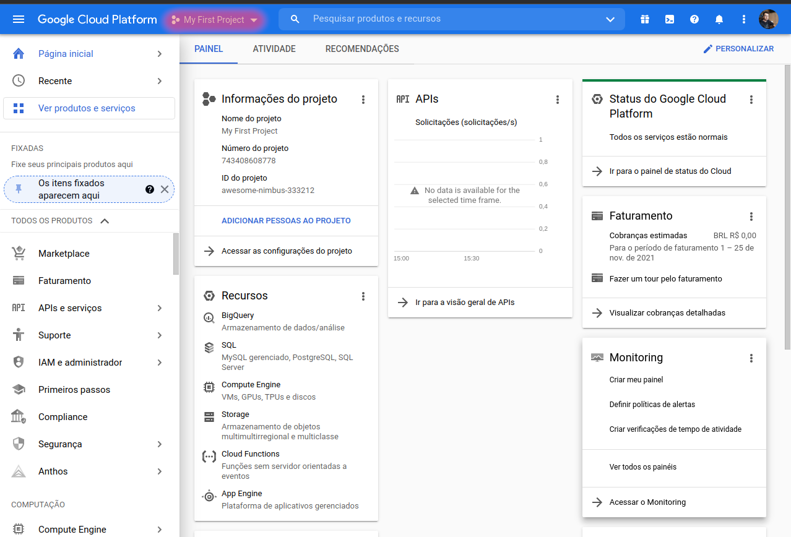

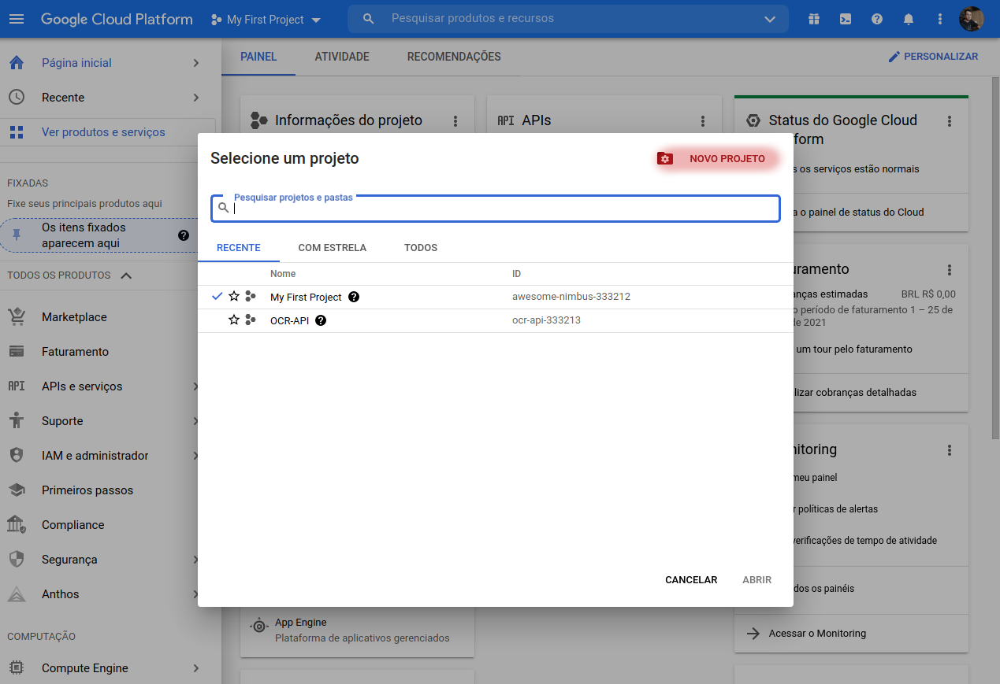

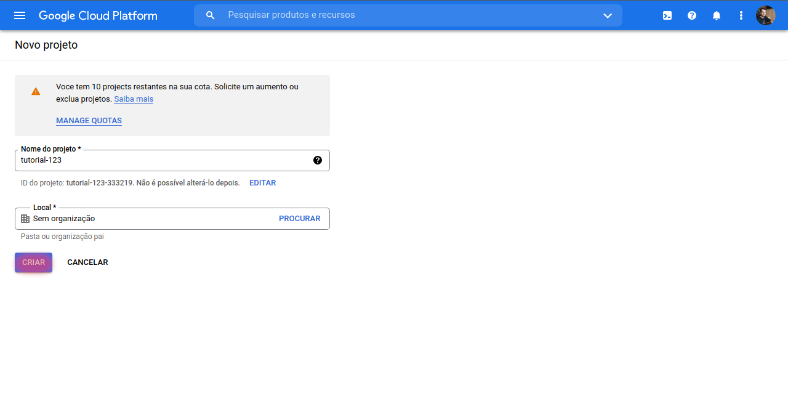

Com o projeto criado, agora devemos ir para a dashboard do mesmo, para isso siga os passos das próximas imagens:

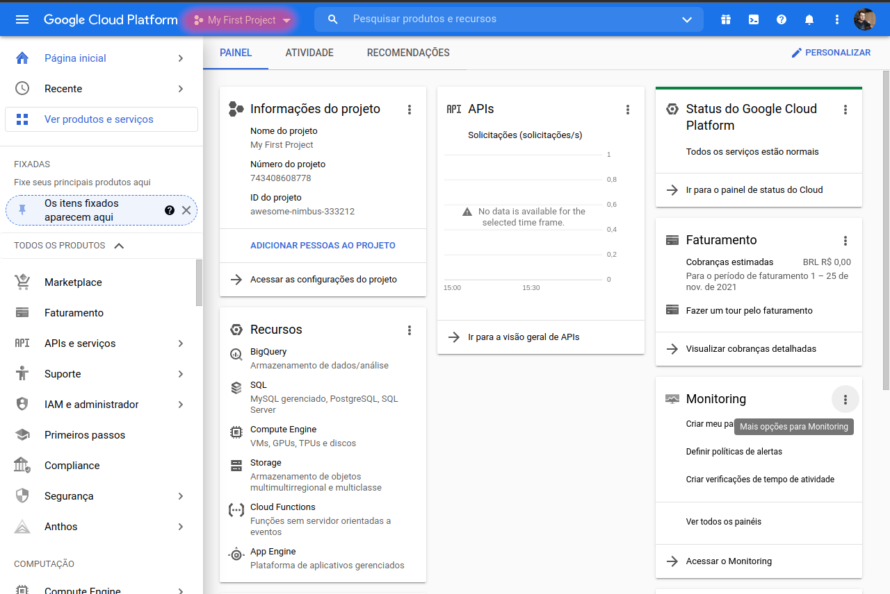

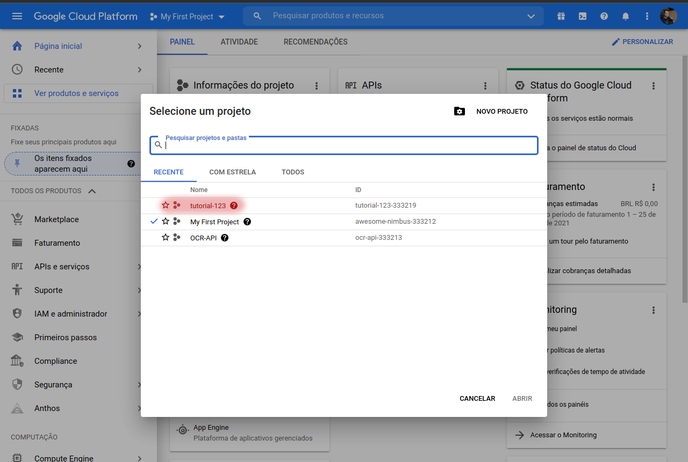

Agora será necessário adicionar a bibliote Cloud Vision ao projeto, para isso siga os passos das próximas imagens:

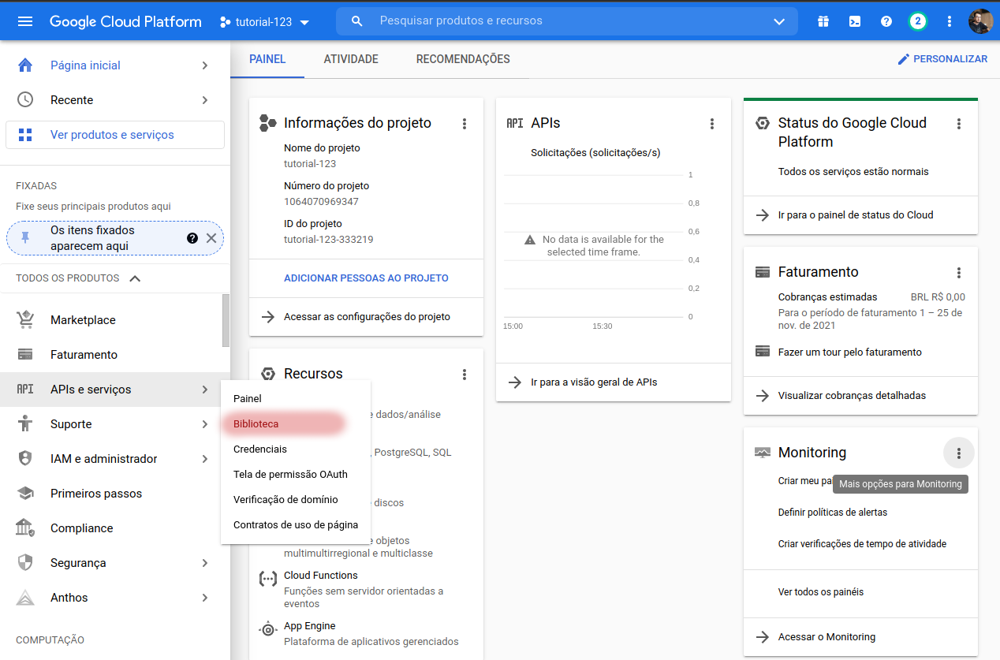

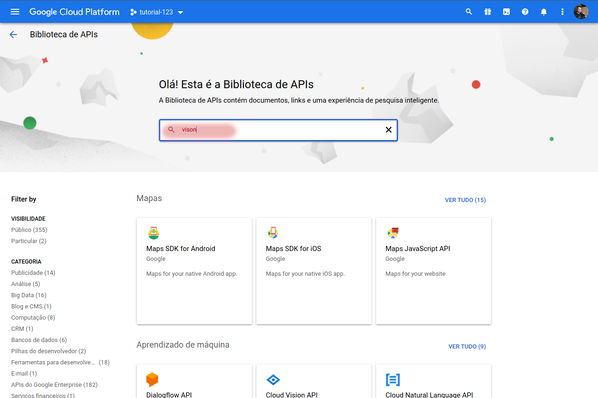

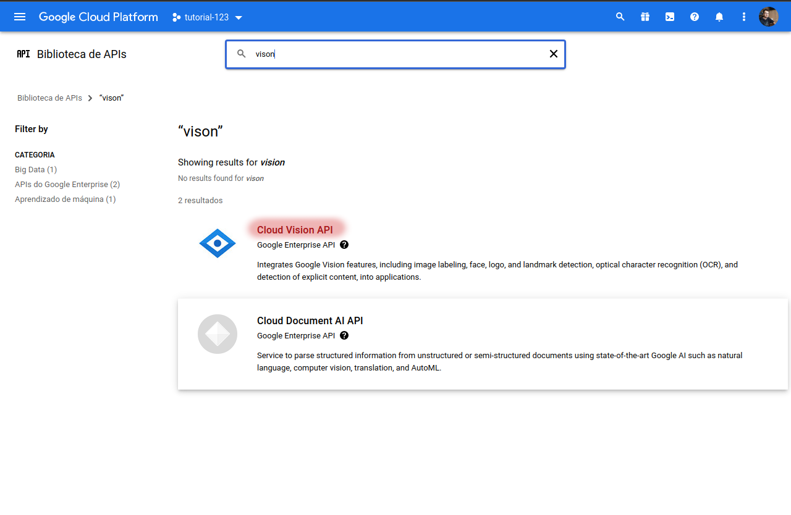

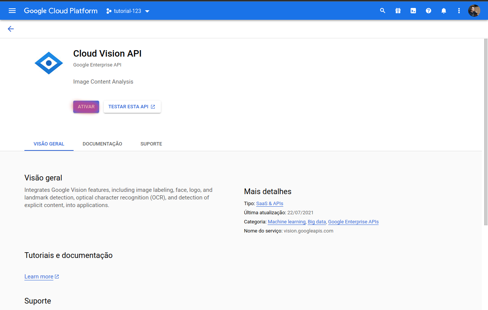

Com a biblioteca Cloud Vision adicionada, necessitamos de uma conta de serviço para poder utilizar a aplicação, para isso siga os passos das próximas imagens:

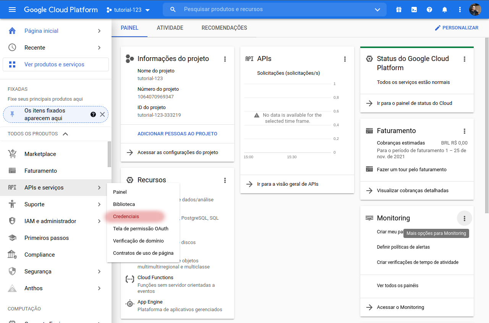

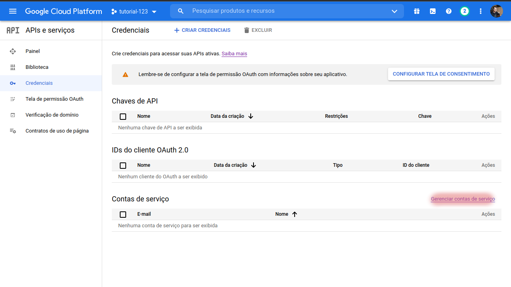


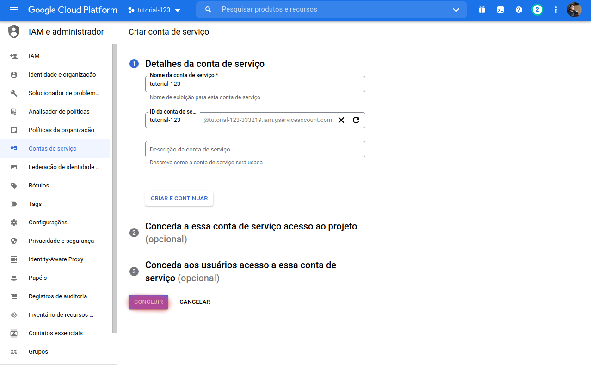

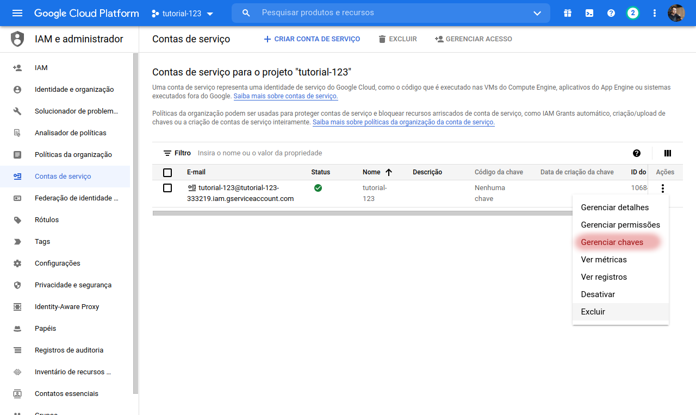

Com a conta de serviço criada, necessitamos de uma chave para poder realizar as requisições, para isso siga os passos das próximas imagens:

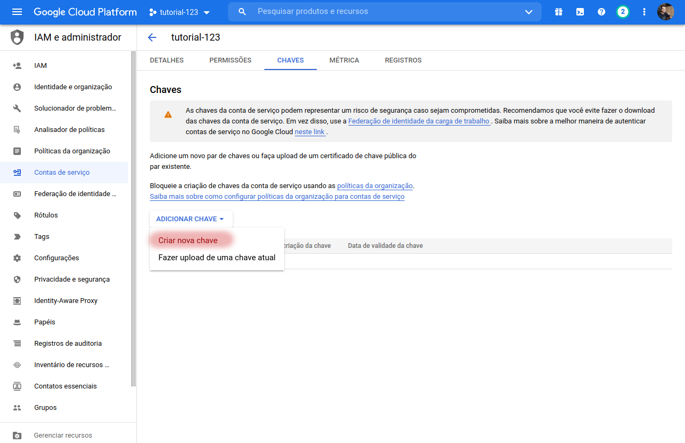

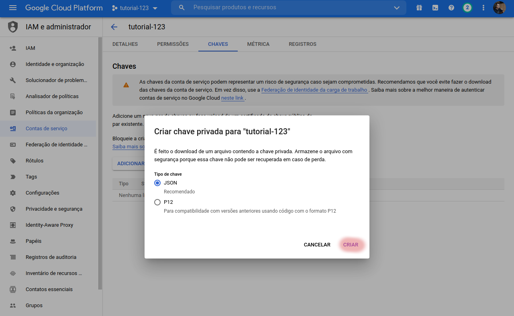

Ao finalizar o processo, o download de um arquivo json contendo a chave da aplicação será gerado, **renomeie-o** para **api-key.json** e o adicione na raiz do projeto.

### 🎲 Comandos Para Iniciar Aplicação

```bash
# Clone este repositório
$ git clone https://github.com/brunobrolesi/node-ocr-api.git

# Acesse a pasta do projeto no terminal/cmd
$ cd node-ocr-api

# Instale as dependências
$ npm install

# Defina as variáveis de ambiente em um arquivo .env seguindo o explempo fornecido, pode-se apenas renomea-lo para .env para facilitar o processo
$ mv .env.example .env

# Rode os testes (opcional)
$ npm test

# Rode o o comando de build
$ npm run build

# Inicie o projeto
$ npm start

# O servidor inciará por padrão na porta:3000
```

### 🛫 Rotas

Para ober o texto de um determinado captcha, envie a imagem para o endpoint:

`localhost:3000/api/letter-captcha`

A imagem deve ser enviado no formato **multipart/form-data** utilizando a chave **file**

### 🛠 Tecnologias

As seguintes ferramentas foram utilizadas na construção do projeto:

- [Node.js](https://nodejs.org/en/)
- [Express](https://expressjs.com/pt-br/)
- [TypeScript](https://www.typescriptlang.org/)
- [Jest](https://jestjs.io/pt-BR/)
- [Google Cloud Vision](https://cloud.google.com/vision)
